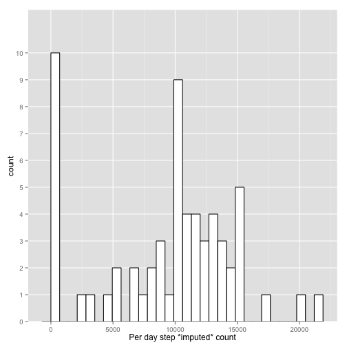
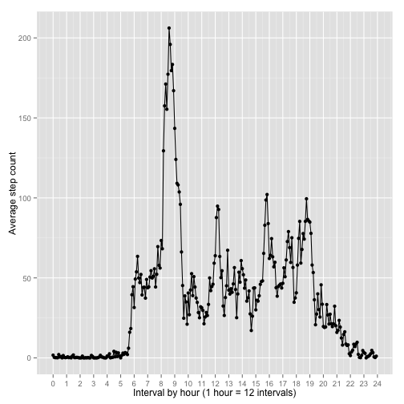
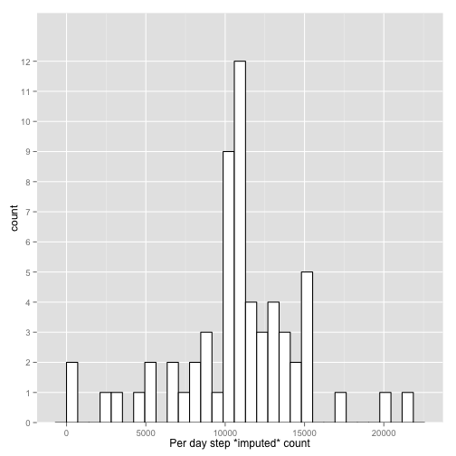
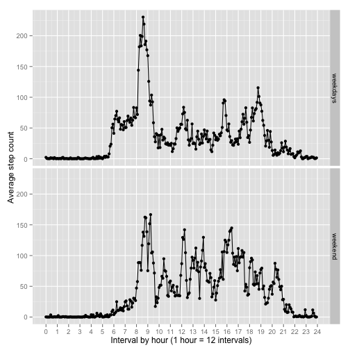

=========================

*Note: the answers  to questions and comments for the solution are provided in italics.*

*A prelude with packages and utility functions.*


```r
# This script should be executed in the directory where the data lie
library(dplyr)      # Data processing
library(ggplot2)    # Visualization
library(lubridate)  # Date input/processing/output

# Convenience functions to deal with interval ids
as.minutes <- function(interval){  # A function to transform interval ids into minutes
    return((interval %/% 100) * 60 + (interval %% 100))
    }
as.interval <- function(dur){      # A function to transform a duration into an interval id
    return((dur %/% 60)*100 + (dur %% 60))
}
```
## Loading and preprocessing the data


```r
# load the data and tidy it
file <- "activity.csv"
dfRaw <- read.csv(file)    # Read the raw data, then...
str(dfRaw)
```

```
## 'data.frame':	17568 obs. of  3 variables:
##  $ steps   : int  NA NA NA NA NA NA NA NA NA NA ...
##  $ date    : Factor w/ 61 levels "2012-10-01","2012-10-02",..: 1 1 1 1 1 1 1 1 1 1 ...
##  $ interval: int  0 5 10 15 20 25 30 35 40 45 ...
```
*The only preprocessing done is:*

1. *Interpreting the dates with the help of the **lubridate** package.*

2. *Transforming the complex encoding of intervals into durations in minutes.*


```r
df <- dfRaw %>%    # Read the raw data, then...
    mutate(date=ymd(date))  %>% # Mutate date strings into proper dates
    mutate(interval=as.minutes(interval)) # mutate interval to minute durations
summary(df)   # Prinf brief description of data after preprocessing.
```

```
##      steps             date               interval     
##  Min.   :  0.00   Min.   :2012-10-01   Min.   :   0.0  
##  1st Qu.:  0.00   1st Qu.:2012-10-16   1st Qu.: 358.8  
##  Median :  0.00   Median :2012-10-31   Median : 717.5  
##  Mean   : 37.38   Mean   :2012-10-31   Mean   : 717.5  
##  3rd Qu.: 12.00   3rd Qu.:2012-11-15   3rd Qu.:1076.2  
##  Max.   :806.00   Max.   :2012-11-30   Max.   :1435.0  
##  NA's   :2304
```


## What is mean total number of steps taken per day?

1. Make a histogram of the total number of steps taken each day


```r
#work out and store total steps per day count
spd <- df %>% 
    group_by(date)  %>% 
    summarise(stepCount = sum(steps, na.rm=TRUE))  # Remove na's as per the statement.
ggplot(spd, aes(x=stepCount)) + 
    xlab("Per day step *imputed* count") +       # proper x label
    scale_y_discrete() +                         # Make count labels integer       
    geom_histogram(fill="white", color="black")  # plot as a histogram
```

```
## stat_bin: binwidth defaulted to range/30. Use 'binwidth = x' to adjust this.
```

 


2. Calculate and report the mean and median total number of steps taken per day


```r
# Keep for later comparison
SpdMeanMedian <- summarise(spd, mean(stepCount), median(stepCount))
SpdMeanMedian
```

```
## Source: local data frame [1 x 2]
## 
##   mean(stepCount) median(stepCount)
## 1         9354.23             10395
```

# What is the average daily activity pattern?

1. Make a time series plot (i.e. type = "l") of the 5-minute interval (x-axis) and the average number of steps taken, averaged across all days (y-axis)

*Making this plot motivates transforming the initial encoding of intervals into durations in minutes, so that the line plot makes sense. We have also made two plotting decisions: *

1. *To plot the duration range with a 60 minute grid to relate steps to daily activity.*

2. *To make explicit the values of the averages besides their interpolating lines.*


```r
spi <- df %>% 
    group_by(interval) %>%
    summarise(stepAverage = mean(steps, na.rm=TRUE))
ggplot(spi, aes(x=interval, y=stepAverage)) +
    xlab("Interval by hour (1 hour = 12 intervals)") + ylab("Average step count") +
    scale_x_continuous(breaks=seq(0,60*24,60),labels=0:24) + 
    # use a 60 minute grid, for anthropological reasons
    geom_line() + geom_point()  # put both the line and the points to see the data.
```

 

2. Which 5-minute interval, on average across all the days in the dataset, contains the maximum number of steps?


```r
as.interval((spi$interval)[which.max(spi$stepAverage)])
```

```
## [1] 835
```
*In the encoding for the intervals the last two digits are minutes, the first two: hours.*

# Imputing missing values

Note that there are a number of days/intervals where there are missing values (coded as NA). The presence of missing days may introduce bias into some calculations or summaries of the data.

1. Calculate and report the total number of missing values in the dataset (i.e. the total number of rows with NAs)

```r
sum(is.na(df$steps)) # The missing values in the steps. 
```

```
## [1] 2304
```

2. Devise a strategy for filling in all of the missing values in the dataset. The strategy does not need to be sophisticated. For example, you could use the mean/median for that day, or the mean for that 5-minute interval, etc.

*Since we already have them in $spi$, we'll impute the mean for the 5-minute intervals for na value. This is done while creating the database below.*

3. Create a new dataset that is equal to the original dataset but with the missing data filled in.

*We first left join the original data with the averaged data around the intervals, and then use the averaged data co-indexed with the missing data to impute them.*


```r
dfImputed <- left_join(df, spi, by="interval")   # co-index steps and averageSteps...
#names(dfImputed)
naMask <- is.na(dfImputed$steps)                         # Detecting the missing values...
dfImputed$steps[naMask] <- dfImputed$stepAverage[naMask] # The actual imputation...
dfImputed <- select(dfImputed, -stepAverage)             # Then dispose of averages.
sum(is.na(dfImputed$steps))                              # Check that there are no missing values left.
```

```
## [1] 0
```

4. Make a histogram of the total number of steps taken each day and Calculate and report the mean and median total number of steps taken per day. 


```r
#work out and store total steps per day count
spdImputed <- dfImputed %>% 
    group_by(date)  %>% 
    summarise(stepCount = sum(steps))
ggplot(spdImputed, aes(x=stepCount)) + 
    xlab("Per day step *imputed* count") +  # proper x label
    scale_y_discrete() +          # Make count labels integer       
    geom_histogram(fill="white", color="black")
```

```
## stat_bin: binwidth defaulted to range/30. Use 'binwidth = x' to adjust this.
```

 

Do these values differ from the estimates from the first part of the assignment? *Yes!*


```r
summarise(spdImputed, mean(stepCount), median(stepCount))
```

```
## Source: local data frame [1 x 2]
## 
##   mean(stepCount) median(stepCount)
## 1        10766.19          10766.19
```

```r
SpdMeanMedian
```

```
## Source: local data frame [1 x 2]
## 
##   mean(stepCount) median(stepCount)
## 1         9354.23             10395
```

What is the impact of imputing missing data on the estimates of the total daily number of steps?

*The values of mean and median both increase!*

# Are there differences in activity patterns between weekdays and weekends?

1. Create a new factor variable in the dataset with two levels – “weekday” and “weekend” indicating whether a given date is a weekday or weekend day.


```r
dfFinal <- dfImputed %>%
    mutate(day=ifelse(weekdays(date) %in% c("Saturday", "Sunday"), "weekend", "weekdays"))
```

2. Make a panel plot containing a time series plot (i.e. type = "l") of the 5-minute interval (x-axis) and the average number of steps taken, averaged across all weekday days or weekend days (y-axis). See the README file in the GitHub repository to see an example of what this plot should look like using simulated data.

* The same conventions for the plot as above were used.*


```r
spiFinal <- dfFinal %>% 
    group_by(day=as.factor(day),interval)  %>%  # group first by the factor, then the date
    summarise(stepAverage = mean(steps))# summarisation works on the last grouping factor
p <- ggplot(spiFinal, aes(x=interval, y=stepAverage)) + 
    xlab("Interval by hour (1 hour = 12 intervals)") + ylab("Average step count") +
    scale_x_continuous(breaks=seq(0,60*24,60),labels=0:24) + 
    geom_line() + geom_point()
p + facet_grid(day ~ .)  # facet on the day factor.
```

 
